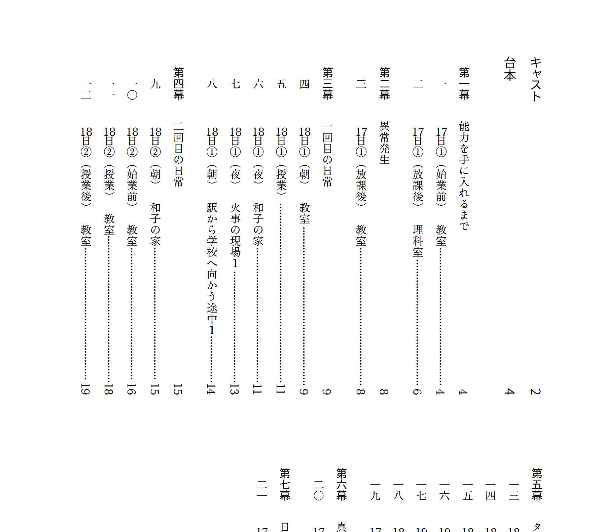
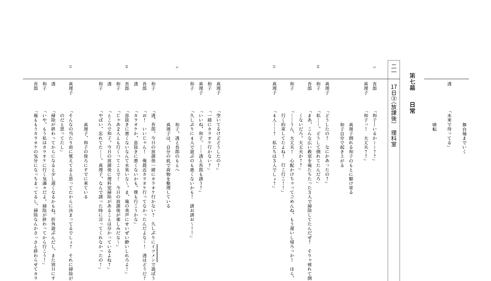
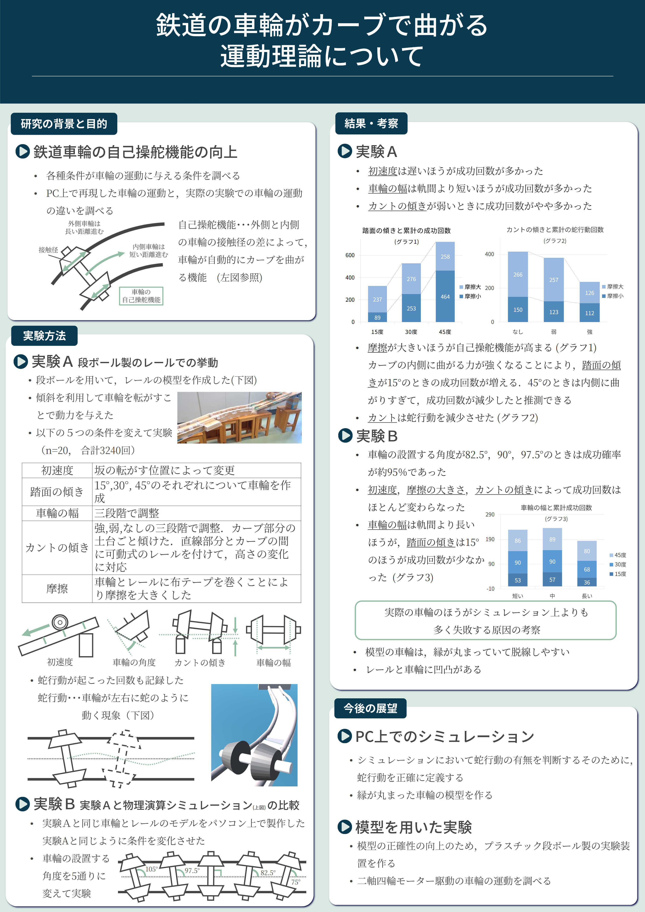
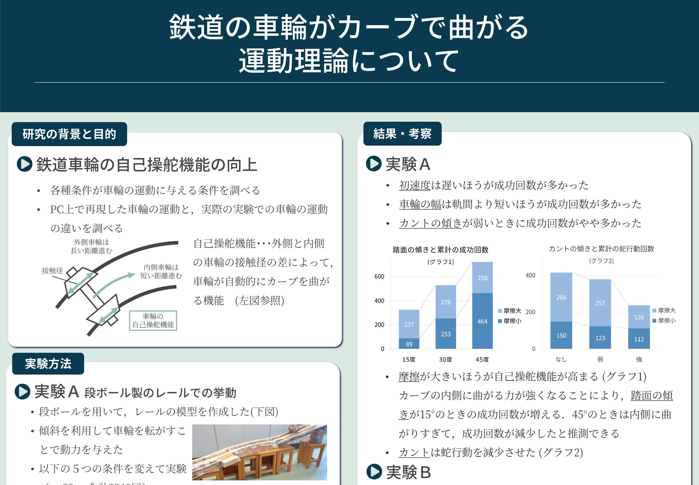
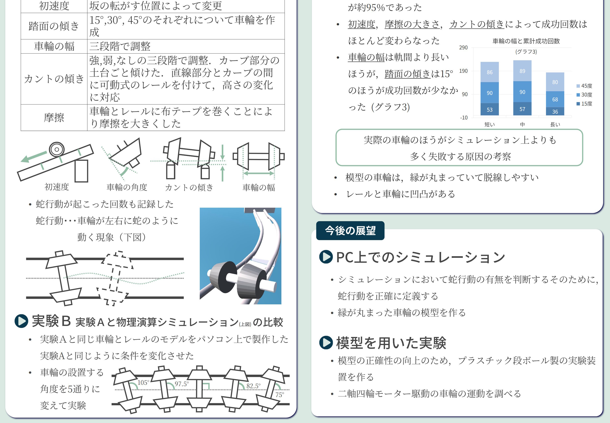
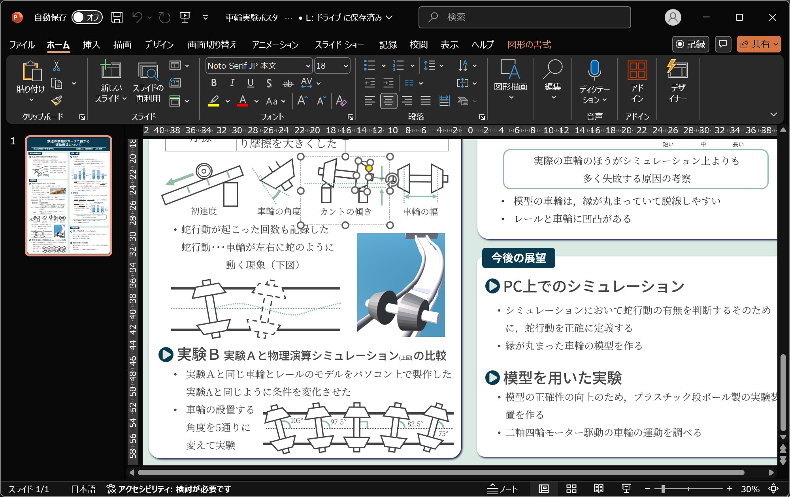
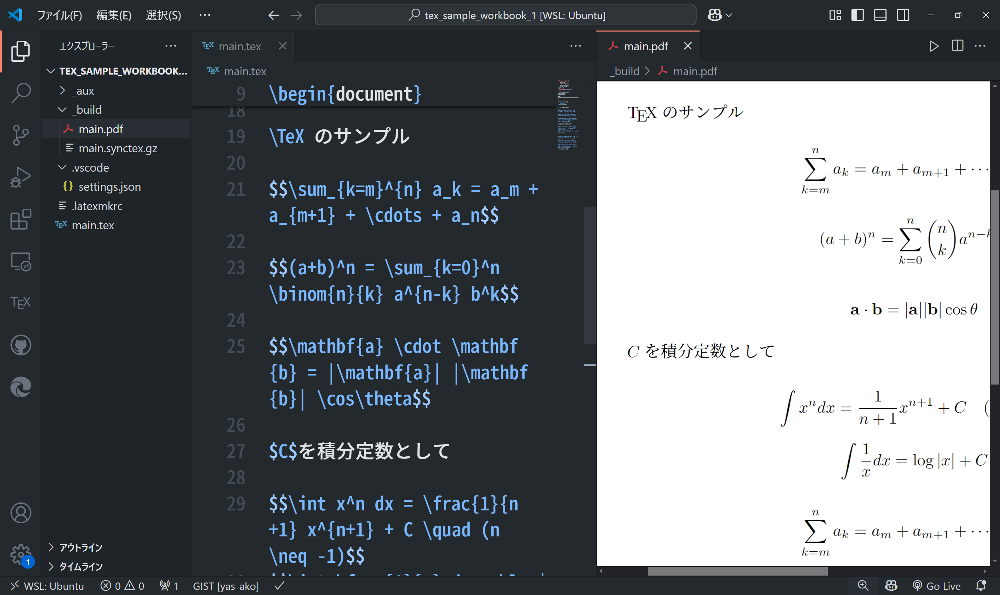
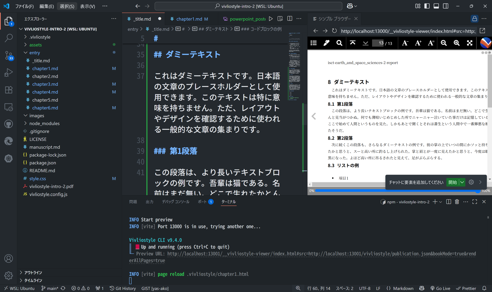

## Vivliostyle の全体像{#chapter1}

##

### そもそも Vivliostyle って？{.image-right}

- CSS 組版のためのソフトウェア
  - HTML/CSS などの Web 技術で組版をする
- traP Tech Book で、PDF を出力する際に使用している らしい...？

### 組版とは？{.image-left}

- 印刷物の紙面に文字や図などを配置し、レイアウトする
- フォント、文字サイズ、行間の広さ、1 行の文字数、 改行位置、余白....　などについて考える
- 画像は、「日本語組版処理の要件」より (https://www.w3.org/TR/jlreq/#fig1_13)
<!-- - 例えば、見出し：プロポーショナルフォント
  - 本文：等幅フォント -->

### 組版ソフトの例：Word{.image-right}

- 簡単
- WISIWG（What You See Is What You Get）
- お金がかかる
- 構造化された文章を書くのがつらい

### 組版ソフトの例：Word{.columns-2}

{style="border:1px solid ###bbb"}

<!-- 
 -->

<!--  -->

<!-- 
 -->

<!-- ### 組版ソフトの例：Word -->

{style="border:1px solid ###bbb"}

<!-- 
 -->

<!--  -->

<!-- 
 -->

### 組版ソフトの例：Indesign{.image-right}

- ほとんど使ったことがないので僕はわかりません
- 組版ソフトウェアのデファクトスタンダードらしい

### 組版ソフトの例：その他

- 朝刊太郎(使ったことはありません)
- 一太郎(使ったことはありません)
- ~~Microsoft Publisher~~
  - 26 年でサポートが切れるらしい
- ほかにもいろいろあるよね

### 組版ソフトの例：？？？

<!--  -->

<!--  -->

### 組版ソフトの例：？？？{.columns-2}

<!--  -->

<!-- ### 組版ソフトの例：？？？ -->

<!--  -->

### 組版ソフトの例：PowerPoint

<!--  -->

### 組版ソフトの例：$\mathrm \TeX$

<!--  -->

### Vivliostyle を用いた組版の流れ（入力）{.image-right}

- 原稿
  - Markdown
  - HTML
- CSSファイル
  - 公式/非公式テーマ
  - 自分で作った CSS ファイル
  - テーマを、自分で書いたCSSファイルで上書きし、自分用にカスタマイズすることができる

### Vivliostyle を用いた組版の流れ（出力）

- 一時ファイル
  - HTML (Markdown を入力した場合)
  - publication.json （出力するドキュメントの情報をまとめたファイル）
  - node_modules/ （依存関係のライブラリ、テーマなど）
- 完成品
  - PDF
  - EPUB

### 内部の仕組み

（詳しくは公式ドキュメントやソースコードを参照のこと）

- Vivliostyle.js
- Vivliostyle CLI
  <!-- - を定義したCSSファイルを元に、印刷可能なPDFファイルを生成する。 -->
  - PDF 生成には、内部で Chromium を使用している