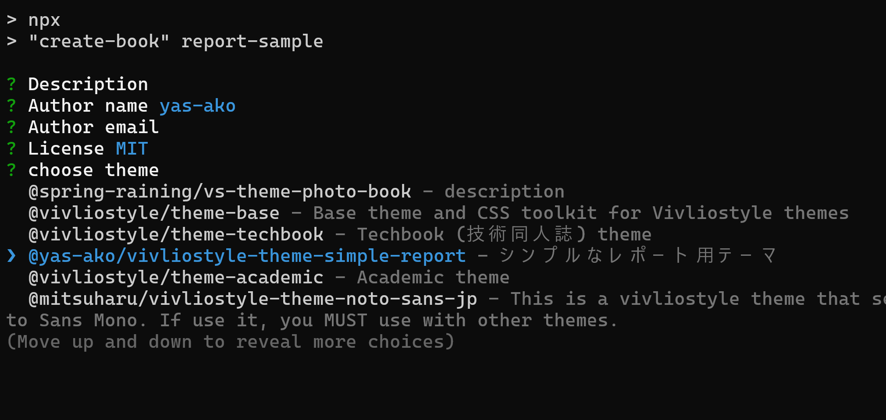
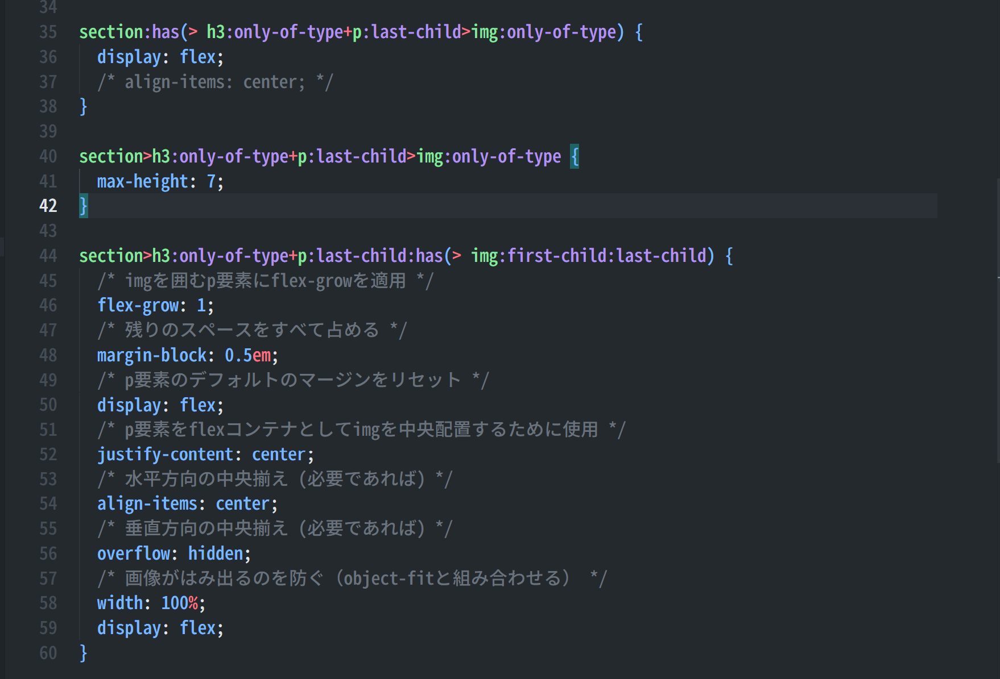

## Vivliostyle の良い点と欠点{style="font-size: 2.5em" #chapter2}

##

### Vivliostyle の良い点(1/3){.image-right}

- 環境構築
  - とても簡単
- 執筆
  - Markdown で書ける
  - HTML も使える
  - Web の知識がそのまま使える
  - TeX の数式が書ける()

### Vivliostyle の良い点(2/3)

- ファイル内にリンクを貼れる
- 図表番号の参照ができる
- 見出しの番号を自由にカスタマイズできる
- ヘッダーとフッターを簡単のカスタマイズできる
- CSS について分からないことがあったとき、AI に聞いたら大体教えてくれる

### Vivliostyle の良い点(3/3)

- 開発が活発（次の例は Vivliostyle cli）
  - v9.0.0 のリリースは 2025/5/3
  - v9.2.0 のリリースは 2025/6/10
  - 約一か月の間に、最新版のリリースが 5 回あった

### Vivliostyle の良い点(<u>4</u>/3)

- 開発が活発（次の例は Vivliostyle cli）
  - v9.0.0 のリリースは 2025/5/3
  - v9.2.0 のリリースは 2025/6/10
  - 約一か月の間に、最新版のリリースが 5 回あった
- これは6月のらんぷろ用に用意した内容

### Vivliostyle の良い点(<u>5</u>/3)

|    日付    | 6/10  | 6/25  | 6/26  | 6/27  | 6/30  | 7/13  |
| :--------: | :---: | :---: | :---: | :---: | :---: | :---: |
| バージョン | 9.2.0 | 9.3.0 | 9.3.1 | 9.3.2 | 9.3.3 | 9.4.0 |

### Vivliostyle の良くない点

- ネットにある情報が少ない
  - ユーザーが少ないため
  - もっといろんな人に広めたい！
- 公式ドキュメントの更新が追いついていない
  - 開発が早いものの、コントリビューターが少ない
- 結局のところ、自分の欲しいデザインを作るためには、試行錯誤が必要
  - どの組版ソフトも同じ？

### Vivliostyle の良くない点

### Vivliostyle の良くない点

もっとCSS勉強します....
