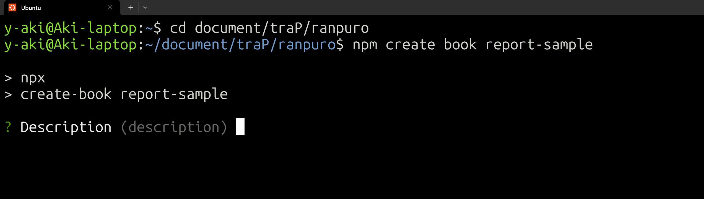
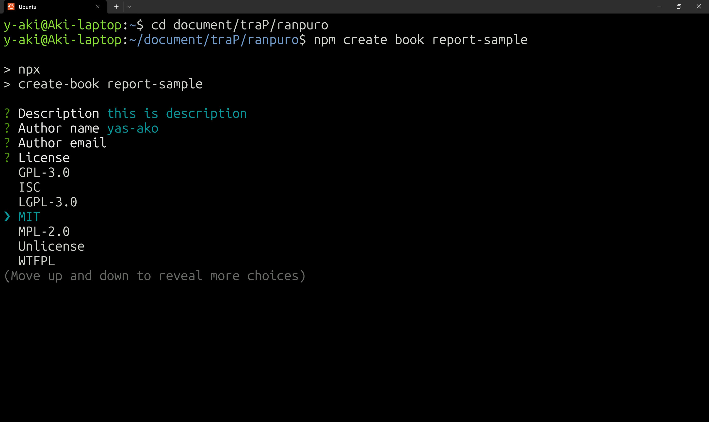
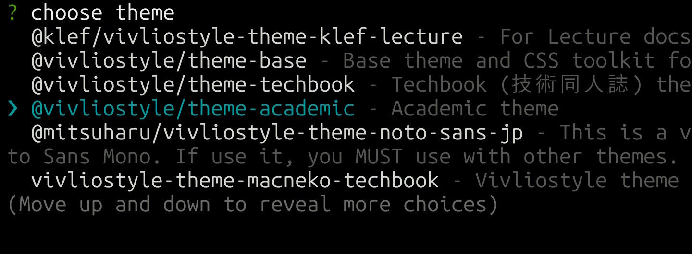
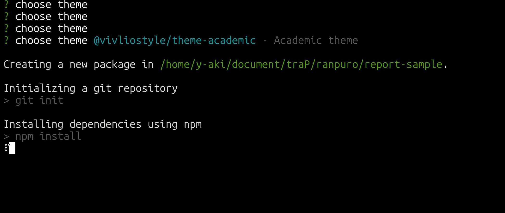
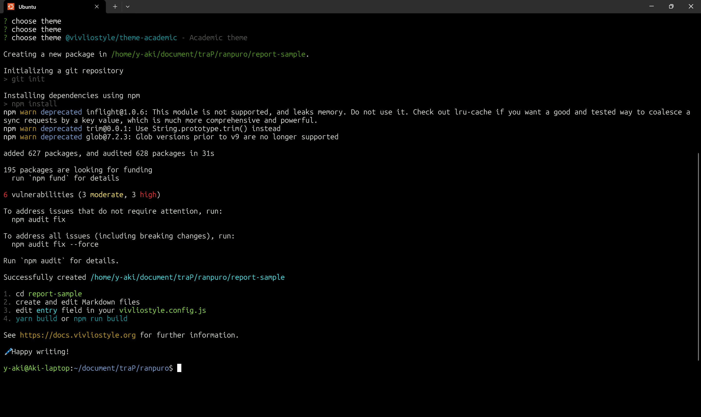
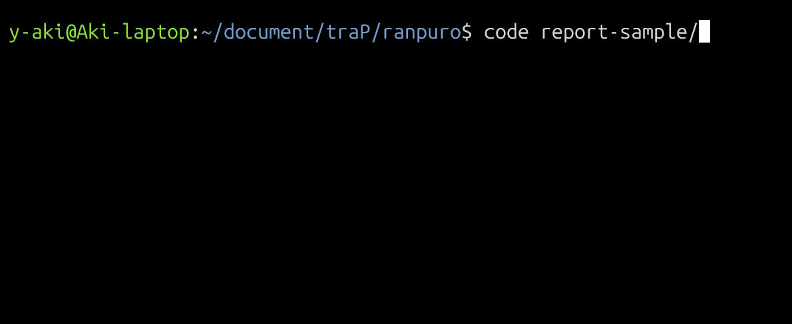
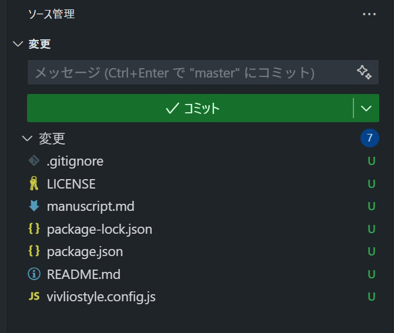
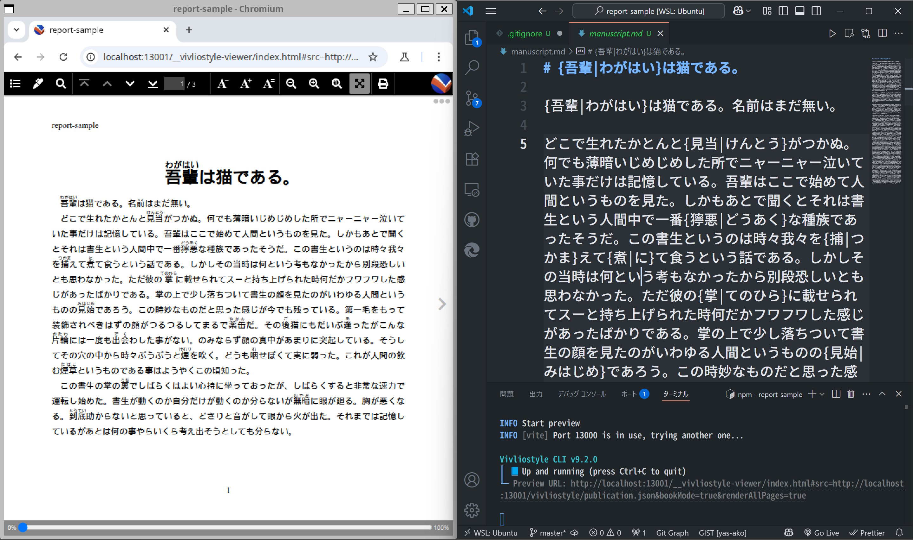

## 実際に使ってみる{#chapter3}

##

### インストール・環境構築 1

- 使い方
  - `npm create book {プロジェクト名}`
    - CLI の質問に答えることで、プロジェクトを作成できる
    - テーマを選択（今回は academic を使用）
  - `npm run preview`
    - ブラウザでプレビューが可能
  - `npm run build`
    - PDF を生成する

### インストール・環境構築 2

- プロジェクトを作成  
- メニューに従って選択



<!-- <div class="horizontal-container"> -->
  <!--  -->
<!-- </div> -->

### インストール・環境構築 3



### インストール・環境構築 4



- テーマを選択
  - 今回は公式テーマである `academic` を選択


### インストール・環境構築 5

- プロジェクトを生成中



### インストール・環境構築 6

- 準備完了



### インストール・環境構築 7

- VSCode でディレクトリを開く



### インストール・環境構築 8

`.vivliostyle` ディレクトリを除外する

```bash title=.gitignore
### Vivliostyle
.vivliostyle/*

### Logs
logs
*.log  ### ...(略)
```

### インストール・環境構築 9

<!-- main ブランチではなく master ブランチになっているので注意 -->



### サンプルを表示してみる

- `npm run preview` を実行すると、ブラウザでプレビューが表示される



<!-- ### サンプルを出力してみる

（VSCodeでマークダウンを開き、ブラウザでプレビューをを開いている画像） -->