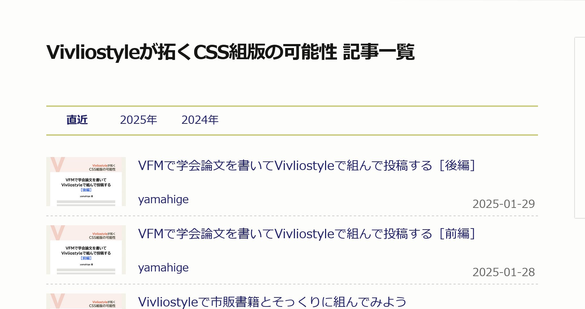

## CSS のカスタマイズの例{style="font-size: 2.7em"}

##

### CSS ファイルの追加・読み込み

- 修正前
  - 最初に指定したテーマが設定されている

```js title=vivliostyle.config.js
module.exports = {
  // ...省略...
  theme: "@vivliostyle/theme-academic@^2.0.0",
  // ...省略...
};
```

### CSS ファイルの追加・読み込み

- 修正後

```js title=vivliostyle.config.js
module.exports = {
  // ...省略...
  theme: ["@vivliostyle/theme-academic@^2.0.0", "assets/style.css"],
  // ...省略...
};
```

### テーマのカスタマイズについて

- まずは次の記事を6本全部読もう  
  <https://gihyo.jp/list/group/Vivliostyleが拓くCSS組版の可能性>



### カスタマイズの仕組み

- Vivliostyle のテーマは、CSS 変数を用いてカスタマイズする
- テーマのソースコードを自分で読まなければならないことがある

```css title=style.css
  --vs--h1-font-size: 1.7em;
  --vs--h2-font-size: 1.7em;
  --vs--h3-font-size: 1.5em;
```

### フォント

- base theme に定義されているCSS変数を上書きすることで、フォントを変更できる

```css title=style.css
/* Google Fontsをインポートした上で */
:root {
  --vs--heading-font-family: "Noto Sans JP";
  --vs--heading-font-weight: 700;
}
```