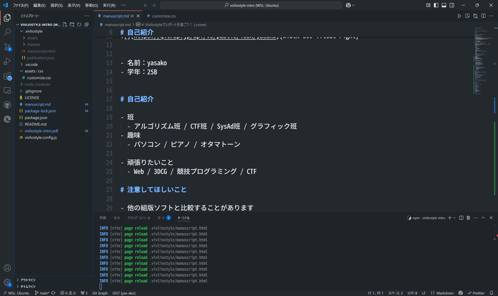
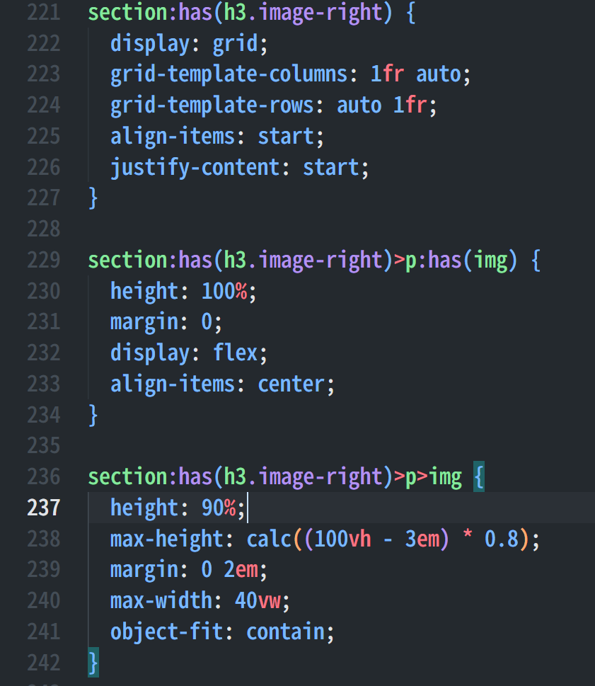
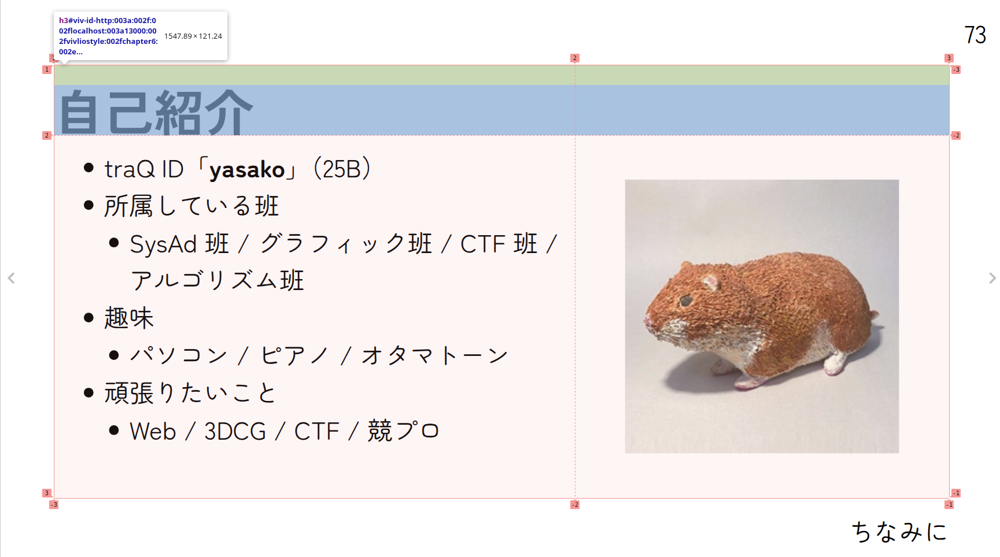

# ちなみに{#chapter6}

#
<!--  -->

### 

<!-- <div class="vertical-container"> -->
<div style="text-align: center;"><strong>このスライドもvivliostyleで作りました</strong></div>



<!-- {width=800 style="margin-inline: auto;"} -->

<!--  -->

<!-- </div> -->

### 余白の説明の続き


```css
:root {
  --vs-page--mbox-content-bottom-right: env(doc-title);
}
```
- このスライドの右下に表示されている「ちなみに」は、次のコードにより表示されている。
- env() は、Vivliostyle によって実装されている。
- このスライドは、章ごとにマークダウンのファイルを分割してある。
- `doc-title` には、各ファイルの先頭にある見出しの内容が自動的に入る。

### 特殊ページの設定{.columns-2}

- 特定のページだけスタイルを変えることができる
  - 背景色を変える / 余白の内容を変える ... など

```css
/* ページを定義 */
@page page-name {
  background-color: #f0f0f0;
}

section:has(h1.something) {
  /* sectionに対してページを設定 */
  page: page-name;
}
```

### 特殊ページの設定(例)

たとえば、 `## こんなかんじに` 書くと

## こんなかんじに

## 

なります。ほかにも、

```
# こうやって

となります。

#
```
と書けば

# こうやって

となります。

#

## このスライドで実現した内容{style="font-size: 2em"}

##

### こう書けば....

```md
### 良い点{.columns-2}

- h1 タグがあるスライド
  - 背景を青に、余白のテキストを表示しない、見出しを中央揃え...
- h2 タグがあるスライド
  - 余白のテキストを表示しない、見出しを中央揃え、見出しの下に下線を引く....


CSSの柔軟なセレクタを最大限に活用できるため、
カスタマイズしやすいテーマを、簡単につくることができる。
```


### 良い点{.columns-2}

- h1 タグがあるスライド
  - 背景を青に、余白のテキストを表示しない、見出しを中央揃え...
- h2 タグがあるスライド
  - 余白のテキストを表示しない、見出しを中央揃え、見出しの下に下線を引く....


CSSの柔軟なセレクタを最大限に活用できるため、
カスタマイズしやすいテーマを、簡単につくることができる。


### 先頭の自己紹介ページだって....

```md
### 自己紹介{.image-right}

- traQ ID「**yasako**」（25B）
- 所属している班
  - SysAd 班 / グラフィック班 / CTF 班 /<br>アルゴリズム班
- 趣味
  - パソコン / ピアノ / オタマトーン
- 頑張りたいこと
  - Web / 3DCG / CTF / 競プロ

{width=350px height=350px}
```

### 自己紹介{.image-right}

- traQ ID「**yasako**」（25B）
- 所属している班
  - SysAd 班 / グラフィック班 / CTF 班 /<br>アルゴリズム班
- 趣味
  - パソコン / ピアノ / オタマトーン
- 頑張りたいこと
  - Web / 3DCG / CTF / 競プロ

{width=350px height=350px}

### ソースコード{.image-right}

- スライドをグリッドで4分割し
  - 上の二つのセルを見出しに
  - 下の二つのセルを、文章と画像にしているだけ



### gridレイアウト



### 今回のスライドに関連する資料

- https://github.com/yas-ako/my-vivliostyle-report-template
  - Vivliostyle のレポートテンプレート を作ってみた
  - 実際にレポートを提出する際に使用した
- https://github.com/yas-ako/vivliostyle-intro
  - このスライドのソースコード
  - 気になるところがあったらなんでも質問してください
    - 分かる範囲でこたえます

### 参考資料(1/2)

- Vivliostyle <https://vivliostyle.org>
- Vivliostyle Themes <https://github.com/vivliostyle/themes###readme>
- Vivliostyle CLI <https://github.com/vivliostyle/vivliostyle-cli###readme>

### 参考資料(2/2)

- [Vivliostyleが拓くCSS組版の可能性](https://gihyo.jp/list/group/Vivliostyleが拓くCSS組版の可能性)
- <https://github.com/vivliostyle/vivliostyle-cli>
- 書籍：『Web技術で「本」が作れる CSS組版Viliostyle入門』 (2023/5/24 発行 リブロワークス著)

### ご清聴ありがとうございました！！{style="font-size: 2em"}

- 発表の内容
  - 1. Vivliostyle の全体像
  - 2. Vivliostyle の良い点と欠点
  - 3. 実際に使ってみる
  - 4. CSS のカスタマイズの例
  - 5. レポートを書こう！

  <!-- - [1. Vivliostyle の全体像](#chapter1)
  - [2. Vivliostyle の良い点と欠点](#chapter2)
  - [3. 実際に使ってみる](#chapter3)
  - [4. CSS のカスタマイズの例](#chapter4)
  - [5. レポートを書こう！](#chapter5)
  - [6. ちなみに](#chapter6) -->
<!-- - <span style="font-size: 30px">緑色の文字は、ファイル内のリンクです。上のページ番号はもちろん自動で挿入されています</span> -->